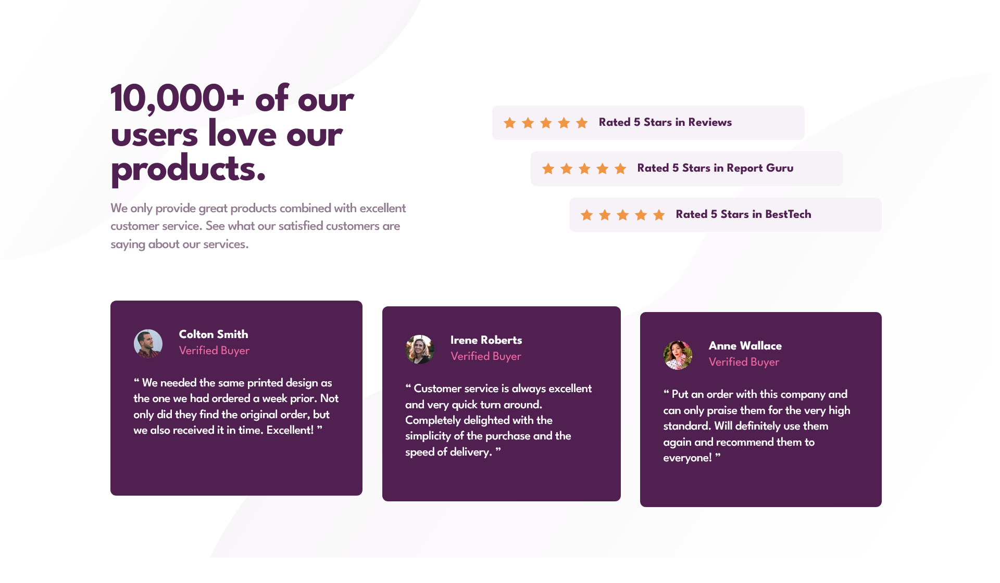

# Frontend Mentor - Social proof section solution

This is a solution to the [Social proof section challenge on Frontend Mentor](https://www.frontendmentor.io/challenges/social-proof-section-6e0qTv_bA). Frontend Mentor challenges help you improve your coding skills by building realistic projects. 

## Table of contents

- [Overview](#overview)
  - [The challenge](#the-challenge)
  - [Screenshot](#screenshot)
  - [Links](#links)

## Overview

### The challenge

Users should be able to:

- View the optimal layout for the section depending on their device's screen size

### Screenshot

### Links

- Solution URL: [https://github.com/CarlosSimon02/fem-social-proof-section-master](https://github.com/CarlosSimon02/fem-social-proof-section-master)
- Live Site URL: [https://fem-social-proof-section-master-carlossimon.vercel.app/](https://fem-social-proof-section-master-carlossimon.vercel.app/)
